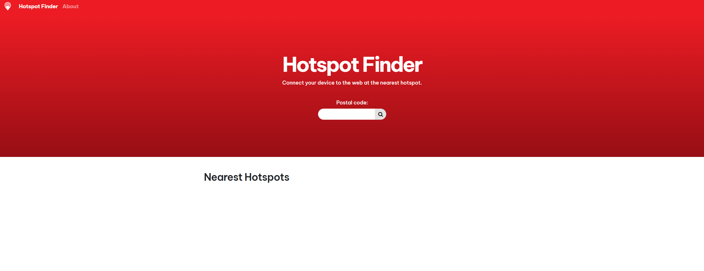

# Hotspot Finder

## Description
Hotspot Finder is a user-friendly hotspot locator app powered by Google Maps and WiGLE APIs. The app was created as a part of Michigan State University's Full Stack Web Development Bootcamp. This was a sandbox-style group challenge, to engineer an app that solves a real world problem. Our team selected the concept of a hotspot locator. Our app allows users to find nearby hotspots to connect their devices on the go, by simply searching their postal code. We challenged ourselves to create an app with clean design and robust functionality. 

## Usage
The deployed app’s URL is https://Jgarnaat.github.io/Hot-Spot-Finder. Screenshots can be viewed below. In order to use the Hotspot Finder app, please use the search bar to look up nearby hotspots by postal code. The app saves the user's last five searches for easy access. The repository for this project can be found at https://github.com/Jgarnaat/Hot-Spot-Finder.

## Screenshots
Upon loading the webpage you will find the main screen

Entering the zip code will populate the map will nearby locations that have free wifi Hotspots

Below the map you will see the street address's for the wifi locations

## Credits
Hotspot Finder was designed and developed by Joshua Garnaat, Kyle Johnson, and Beatriz Strobel. Joshua was responsible for the concept, writing the JavaScript for the app, as well as researching the Google Maps and WiGLE APIs and implementing them. Joshua was also responsible for debugging the app and optimizing it. Kyle was responsible for setting up the HTML code. Beatriz was responsible for the UX/UI design of the app, creating wireframes on Figma, writing the CSS, and implementing bootstrap throughout the HTML. Beatriz was also responsible for accessibility testing and making sure the app follows WACG standards.

## License
MIT License
